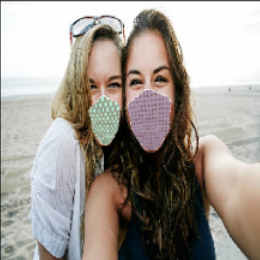
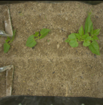
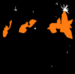
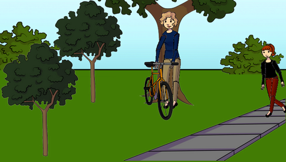
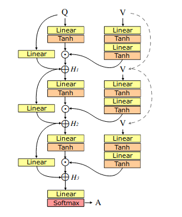

# Content of the repository
The notebooks contained in this repository were created as a project for the Artificial Neural Network and Deep Learning course.
The project was divided into three parts, that were Classification, Segmentation and Visual Question Answering.

# Classification
The notebook contained in the classification directory was trained on a set of images containing people that were either wearing masks or not, and the model had to recognise if all of the people were "masked", if no one had a mask on or if there were people of both sets into the picture. 
For this task we started with custom made models, but once we tried transfer learning we decided to use that instead. 
The model reached an accuracy of over 0.9.

## Example
Given the image below as input

the network correctly outputs that all the people in the picture have the mask on.

# Segmentation
In this notebook the model had the task of segmanting the image, in other words the network determined which parts of the picture were ground, healthy plants or weeds.
Our network was basically an implementation of UNet, and it reached a meanIoU (mean Intersection over Union) between 0.60 and 0.65.

## Example
Given the input below

the model processed the image to correctly determine which pixels represented the ground and which ones were a plant, as shown in the following image

The network also correctly classified some pixels as weed (the white parts of the output)

# Visual Question Answering

The task that need to be performed in this notebook was to correctly answer to a question that referred to an image.

## Example

With as input the question "How many people are in the picture?" and the following picture

the answer (that had to be selected among 50+ possibilities) had to be "2".

The architecture used for the project was the following:

- first, split the question in two categories (those which required boolean answers and those who didn't), so the balancing of the dataset was automatic
- once the type of question was determined, feed the input to the network that was trained for that type of task.

The architecture of the single networks is taken from a paper (arxiv link is in the notebook) and is the following:

This residual learning architecture greatly improved the accuracy, which ended up being 0.54.

This project was created in collaboration with Giulio Alizoni and Elia Bonazza for the 2020/2021 edition of the course Artificial Neural Networks and Deep Learning.
